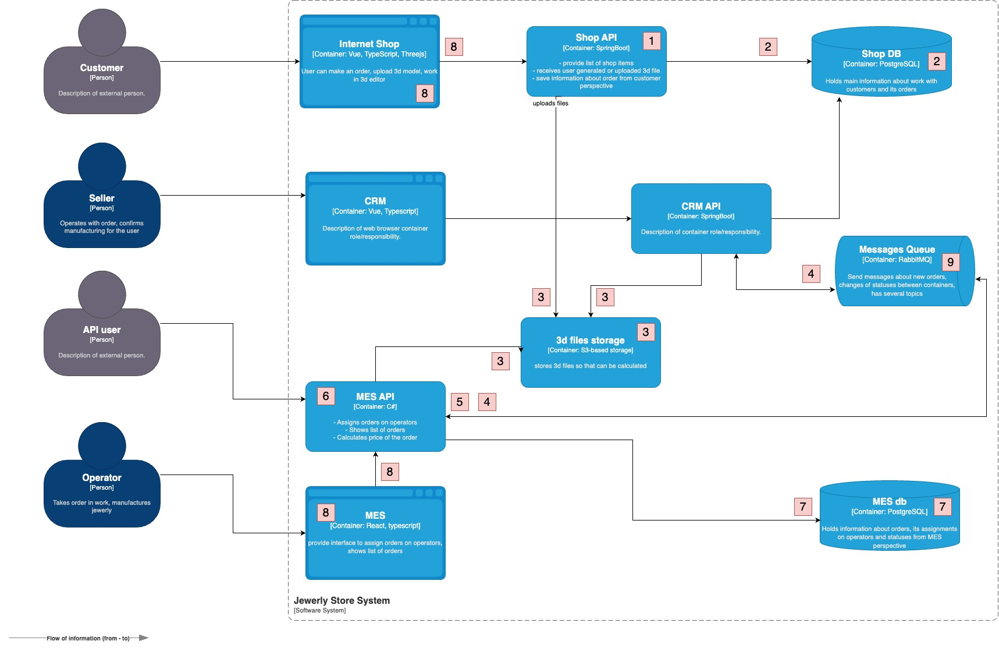
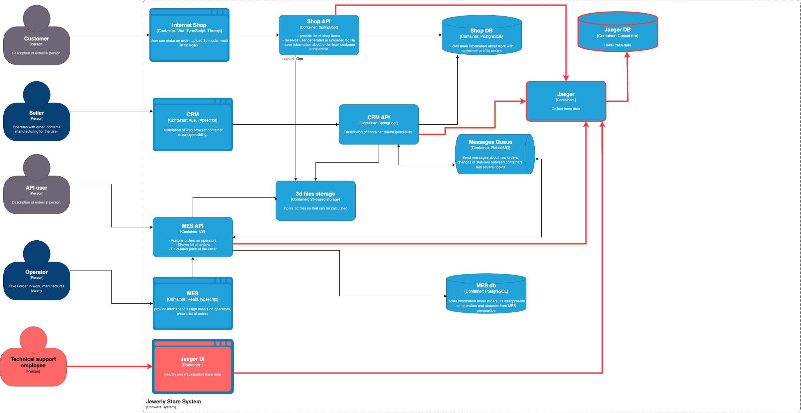

## Трейсинг

### Места, где заказ может «сломаться» или зависнуть
1. SHOP API - Проблемы на уровне приложения. Ошибки в логике контроллера.
2. SHOP DB - Проблемы на уровне инфраструктуры БД. Превышение коннектов, медленные запросы, отсутствие репликации, падение БД.
3. S3 - Проблемы на уровне инфраструктуры S3. Падение сервиса, исчерпание лимитов памяти, ошибка при выбор инфры для S3 (медленная память)
4. Producer брокера (CRM API/MES API). Неверный формат сообщения кладут. Ошибки роутинга и тд.
5. Consumer брокера (MES API). Ошибки в валидации сообщения. Consumer не успевает вычитывать сообщение
6. MES API - Приложение падает при расчетах.
7. MES DB - Проблемы на уровне инфраструктуры БД. Превышение коннектов, медленные запросы, отсутствие репликации, падение БД.
8. Internal SHOP/MES - Ошибка на стороне клиента. Не согласованность данных front и back.
9. Падение брокера.

### Мотивация

Внедрение системы трейсинга является критически важным шагом для повышения стабильности, производительности и надежности наших сервисов, особенно в условиях растущей нагрузки и сложности взаимодействия между компонентами системы. Трейсинг позволит нам получить детальное представление о прохождении каждого запроса через различные сервисы и инфраструктурные элементы, выявляя узкие места и причины возникновения проблем, которые в настоящее время остаются “скрытыми” и трудно диагностируемыми.

Почему трейсинг необходим?

В настоящее время, при возникновении проблем с заказами, предоставлением информации или согласованностью данных, диагностика причин может занимать значительное время и ресурсы. Отсутствие сквозной видимости затрудняет выявление источника проблемы и координацию действий между различными командами. Трейсинг предоставит необходимую информацию для быстрого и эффективного решения проблем, минимизируя влияние на пользователей и бизнес.

Внедрение трейсинга окажет положительное влияние на следующие технические и бизнес-метрики:

1. Сокращение времени решения инцидентов (MTTR - Mean Time To Resolution): Техническая метрика. Трейсинг позволит быстрее выявлять и устранять причины проблем, сокращая время простоя сервисов и минимизируя негативное влияние на пользователей. Ожидается сокращение MTTR на 20-50%.
2. Увеличение процента успешных заказов (Success Rate): Бизнес-метрика. Благодаря более быстрой и эффективной диагностике и устранению проблем, уменьшится количество “сломанных” заказов, что приведет к увеличению процента успешно завершенных транзакций. Ожидается увеличение Success Rate на 1-3%.
3. Улучшение времени ответа API (Response Time): Техническая метрика. Трейсинг позволит выявлять узкие места в API и оптимизировать их работу, что приведет к сокращению времени ответа и улучшению пользовательского опыта. Ожидается сокращение времени ответа на 10-20% для критических API.
4. Уменьшение количества ошибок (Error Rate): Техническая метрика. Трейсинг позволит выявлять причины возникновения ошибок и предотвращать их повторение, что приведет к снижению количества ошибок в системе. Ожидается снижение Error Rate на 10-15%.
5. Повышение удовлетворенности клиентов (Customer Satisfaction - CSAT): Бизнес-метрика. Более стабильная работа сервисов, меньшее количество ошибок и быстрое решение проблем положительно скажутся на удовлетворенности клиентов. (Эта метрика сложнее измерить напрямую, но она является важным долгосрочным эффектом от внедрения трейсинга).

В заключение, внедрение трейсинга является инвестицией в стабильность, производительность и надежность нашей системы, что приведет к улучшению пользовательского опыта, повышению эффективности работы команд разработки и операций, и, в конечном итоге, к увеличению прибыльности бизнеса.

### Предлагаемое решение

### Компромиссы
Несмотря на значительные преимущества, внедрение трейсинга не всегда является оптимальным решением. Существуют ситуации, когда его польза ограничена, реализация невозможна или экономически нецелесообразна.
1. Если доработка legacy систем окажется сложной, то на первом этапе можно ограничиться мониторингом. 
2. Внедрение трейсинга требует ресурсов на разработку, настройку и обслуживание. Если команда ограничена в ресурсах, внедрение трейсинга может затянуться или быть реализовано неполноценно. В таком случае, стоит рассмотреть поэтапное внедрение, начиная с наиболее критичных сервисов.
3. Добавление инструментирования для трейсинга может привести к небольшому снижению производительности сервисов.
4. Хранение данных трассировок может потребовать значительных объемов хранилища, особенно при высокой нагрузке. Необходимо учитывать стоимость хранения и настроить политику хранения данных, чтобы удалять старые трассировки.

### Аспекты безопасности
1. Аутентификация и авторизация. Доступ к системе трейсинга должен быть ограничен только авторизованным сотрудникам компании.
2. Шифрование данных. Использовать шифрование для защиты данных трассировок при передаче между сервисами и компонентами системы трейсинга (например, TLS/SSL).
3. Ограничение данных, передаваемых в трассировки. Минимизировать объем данных, передаваемых в трассировки. Избегать передачи конфиденциальной информации.
