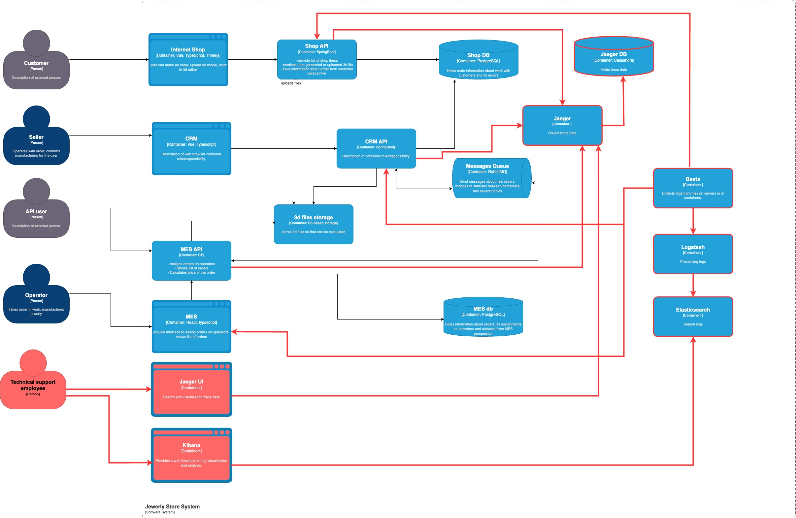

## Логирование
### Необходимые логи
В систему необходимо добавить логи в уровнем INFO, где происходит изменение статуса заказа.
В лог добавить:
1. Дата и время
2. request-id
3. ID пользователя, действия которого были выступили триггером
4. Order ID

Необходимо также добавить логи с уровнем ERROR, где происходит получение сообщения из брокера. Необходимо логироватьи сообщения, которые не прошли валидацию, перед тем как поместить их в dead letters.

Необходимо добавить логи в систему, где происходит обработка ошибочных сценариев.
1. Не выполнен коммит в БД
2. Не прошли валидацию
3. Ошибки по логики
4. Недоступность ресурсов

Другие уровни логирования пока бы не использовал.

### Мотивация

В условиях растущей сложности и нагрузки на наши сервисы, внедрение комплексной системы логирования и трейсинга становится критически важным для поддержания стабильности, производительности и надежности. Логирование и трейсинг дополняют друг друга, обеспечивая всестороннее представление о работе наших систем. Логирование позволяет получить детальную информацию о событиях, происходящих в системе, а трейсинг обеспечивает сквозную видимость прохождения запросов через различные сервисы.

Влияние внедрения логирования на ключевые метрики:
1. Сокращение времени решения инцидентов (MTTR - Mean Time To Resolution): Техническая метрика. Логирование позволит быстрее выявлять причины проблем, сокращая время простоя сервисов. Ожидается сокращение MTTR на 15-30%.
2. Уменьшение количества ошибок (Error Rate): Техническая метрика. Логирование позволит выявлять причины возникновения ошибок и предотвращать их повторение. Ожидается снижение Error Rate на 5-10%.
3. Улучшение понимания поведения системы: Техническая метрика. Анализ логов позволит получить более глубокое понимание поведения системы и выявить области для оптимизации. (Сложно измерить количественно, но это важный фактор для принятия решений).
4. Повышение безопасности: Бизнес-метрика. Своевременное выявление подозрительной активности в логах позволит предотвратить инциденты безопасности, которые могут привести к финансовым потерям и репутационным рискам.

### Приоритизация внедрения логирования и трейсинга:
Критически важные сервисы (SHOP API, CRM API, MES API)
Обоснование: Эти сервисы являются ключевыми для бизнеса и обеспечивают взаимодействие с клиентами и другими системами. Проблемы в этих сервисах оказывают наибольшее влияние на бизнес.

Взаимодействие, которое можно логировать на следующих этапах:
1. RabbitMQ
2. Базы данных (Shop DB, MES DB)
3. S3 хранилище

### Предлагаемое решение
Предлагается внедрить централизованную и масштабируемую систему логирования на базе стека Elasticsearch, Logstash и Kibana (ELK)

Технологии и компоненты:
1. Elasticsearch: Time-series база данных для хранения логов. Обеспечивает быстрый поиск и анализ больших объемов данных.
2. Logstash: Компонент для сбора, обработки и преобразования логов. Позволяет парсить неструктурированные логи, добавлять метаданные и фильтровать ненужные записи.
3. Kibana: Веб-интерфейс для визуализации и анализа логов. Позволяет создавать дашборды, строить графики и проводить ad-hoc анализ.
4. Beats (Filebeat): Легкий агент для сбора логов, метрик и мониторинга доступности сервисов. Устанавливается на каждом сервере или в контейнере для отправки данных в Logstash.

#### Политика хранения логов
1. Определить политику хранения логов на основе нормативных требований и потребностей бизнеса.
Рекомендуемый срок хранения: Хранить логи за последние 10 дней для оперативного анализа.
2. Архивировать старые логи в более дешевое хранилище (например, S3) для долгосрочного хранения и анализа.

#### Превращение системы сбора логов в систему анализа
1. Настроить алерты в Kibana для уведомления о критических событиях (например, ошибки, перегрузки, подозрительная активность).
2. Интегрировать систему алертинга с системами уведомлений

#### Пример правил обнаружения аномалий
1. DDoS-атака: “Если количество запросов к SHOP API увеличилось на 1000% за последние 5 минут, отправить уведомление в канал безопасности.”
2. Неуспешное создание заказов: “Если количество ошибок при создании заказов (HTTP 500) превысило 5% за последние 15 минут, отправить уведомление в канал поддержки.”