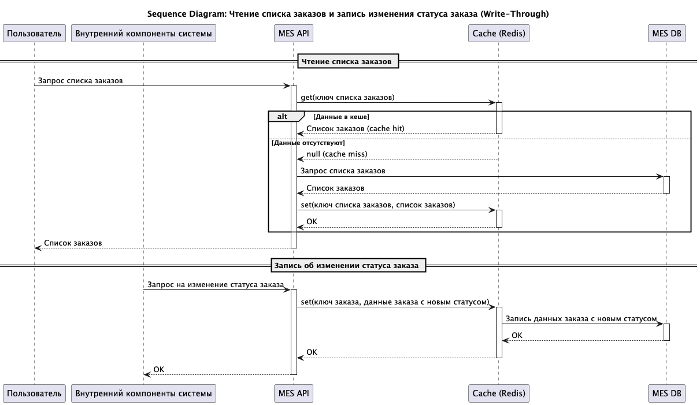

## Кеширование
### Мотивация
Внедрение кеширования в сервис MES API представляет собой стратегически важный шаг, направленный на повышение производительности, снижение нагрузки на инфраструктуру и улучшение пользовательского опыта. Рассмотрим более детально, как кеширование позволит решить указанные проблемы:
1. Уменьшение времени ответа и увеличение скорости обновления данных для формирования дашборда заказов. Формирование дашборда заказов требует частого запроса данных по заказам и их статусам. Каждый запрос к БД MES DB приводит к задержке, увеличивая время ответа API и снижая скорость обновления дашборда. Это негативно влияет на пользовательский опыт, особенно при работе с большим объемом данных.
2. Снижение нагрузки на БД MES DB. Сервис MES API открыт для сторонних продавцов, что приводит к значительному увеличению нагрузки на чтение данных из БД MES DB. Каждый запрос от стороннего продавца требует обращения к БД, что увеличивает время ответа и может привести к перегрузке БД.

# Так как происходит кеширование данных, которые нельзя инвалидировать по TTL (обновление статуса заказа), то предлагаю использовать паттерн Write-Through.

### Инвалидация данных
Учитывая выбранный паттерн Write-Through и требования к согласованности данных, критически важным является выбор эффективной стратегии инвалидации кеша. Поскольку в нашем случае необходимо обеспечить актуальность данных о статусе заказов, которые могут изменяться достаточно часто, проанализируем и выберем оптимальную стратегию инвалидации.

Сравнительный анализ стратегий инвалидации:

|Стратегия|                                                    Описание                                                    |                                            Преимущества                                            |Недостатки|Подходит для MES API|Примечания|
|:-:|:--------------------------------------------------------------------------------------------------------------:|:--------------------------------------------------------------------------------------------------:|:-:|:-:|:-:|
|Временная (TTL)|Данные в кеше автоматически удаляются по истечении заданного времени (Time-To-Live).|                                        Простота реализации.                                        |Данные могут быть устаревшими до истечения TTL. Неэффективно для данных с неравномерной частотой изменений.|Нет|Не подходит, так как не гарантирует актуальность статусов заказов, которые могут изменяться непредсказуемо.|
|По ключу (Event-based)|Данные в кеше удаляются явно при возникновении определенного события (например, изменение статуса заказа).|               Гарантирует актуальность данных. Эффективно для данных с высокой частотой изменений. | Требует реализации механизма отслеживания событий и удаления связанных данных из кеша. Сложность реализации выше. |Да|Подходит для инвалидации данных о конкретном заказе при изменении его статуса. Не подходит для списков заказов, если не отслеживать изменение каждого заказа в списке.|
|Программная|Приложение самостоятельно определяет, когда нужно обновить данные в кеше.|                                                              Гибкость. Возможность реализации сложных стратегий инвалидации.                                                                 |Требует больше усилий на разработку и поддержку. Может привести к ошибкам и несогласованности данных.|Нет|Не подходит, так как требует более сложной логики в приложении и может привести к человеческим ошибкам. Целесообразно использовать стандартные механизмы кеширования.|
|Основанная на тегах| Данные в кеше помечаются тегами. При возникновении события, все данные с определенным тегом удаляются из кеша. |                    Позволяет эффективно инвалидировать группы связанных данных.                    |Требует добавления логики тегирования данных.|Да, с оговоркой|Подойдет, если логически группировать заказы по определенным критериям (например, заказы определенного пользователя, заказы с определенным статусом). Это позволит инвалидировать сразу группу заказов при изменении одного из них.|

Выбранная стратегия: По ключу (Event-based).

Для обеспечения актуальности данных в системе, предлагается использовать стратегию инвалидации по ключу (Event-based)
При изменении статуса заказа (например, изменении поля в записи БД), сервис MES API отправляет команду в кеш (Redis) на обновление статуса заказа.
